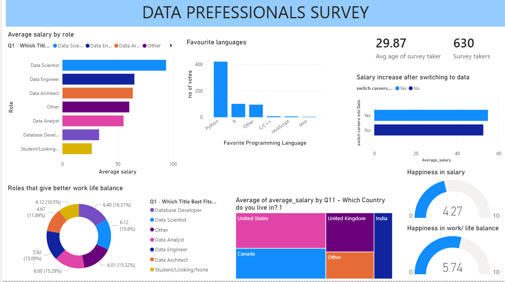

<!-- BANNER -->

<h1 align="center"> Data Professionals Survey Analysis</h1>

  <b>Insights into salaries, skills, and career trends in the data industry</b>

---

<!-- BADGES -->

  
  
  
  

---

##  Overview  
This project analyzes a survey of data professionals to uncover trends in salaries, programming languages, and work-life balance.

---

##  Dashboard Preview  

  

---

## 🎯 Key Insights  

-  **Top Salaries** → Data Scientists & Data Engineers  
-  **Most Popular Language** → Python dominates  
-  **Career Switch Boost** → Switching to data increases salary  
-  **Work-Life Balance** → Generally stable across roles  
-  **Country Trends** → US offers higher average salaries  

---

##  Features  

- Role-based salary comparison  
- Programming language popularity  
- Salary growth after switching careers  
- Work-life balance insights  
- Country-wise salary analysis  
- Happiness metrics  

---

## 📂 Dataset  

- 👥 630 Survey Participants  
- 📊 Fields include:  
  - Job Role  
  - Salary  
  - Programming Language  
  - Country  
  - Work-Life Balance  
  - Happiness Ratings  

---

## Insights Summary

The data field shows strong salary growth potential, especially for technical roles.
Python stands out as the most valuable skill, and career transitions into data roles are highly rewarding.

✨ Author - VASANTHAKUMAR

 <b>Built with data, curiosity, and insights</b> 

<!-- FOOTER --> 
